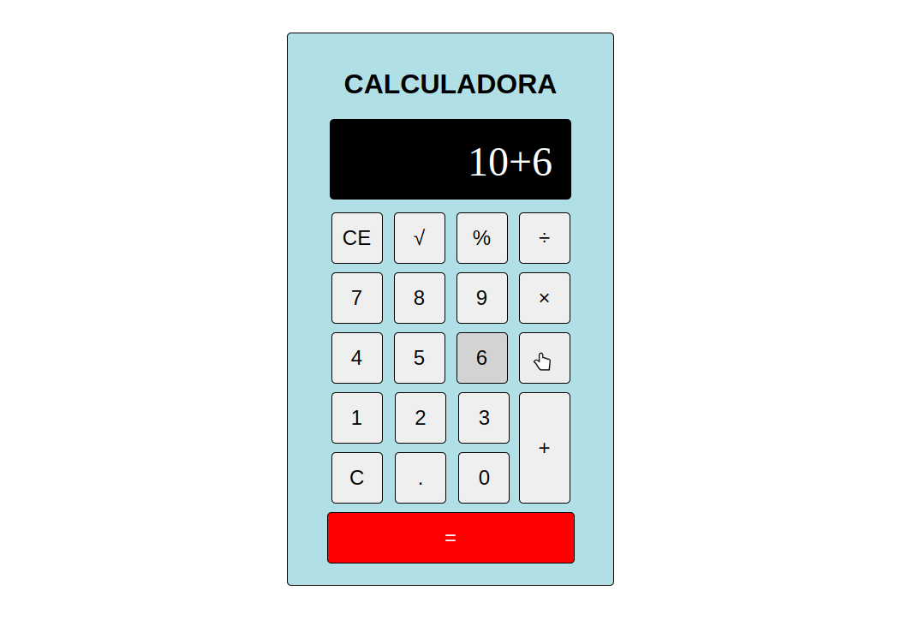

# Calculadora

Uma calculadora, criada com CSS, HTML e JS, capaz de realizar operações de:

* Soma
* Subtração
* Divisão
* Multiplicação
* Raiz Quadrada
* Porcentagem

A expressão irá aceitar mais de uma operação e também validará se o operador pode ou não ser utilizado, por exemplo, uma operação
deve começar com número ou raiz quadrada e caso o requisito não seja atendido, o usuário será alertado.

